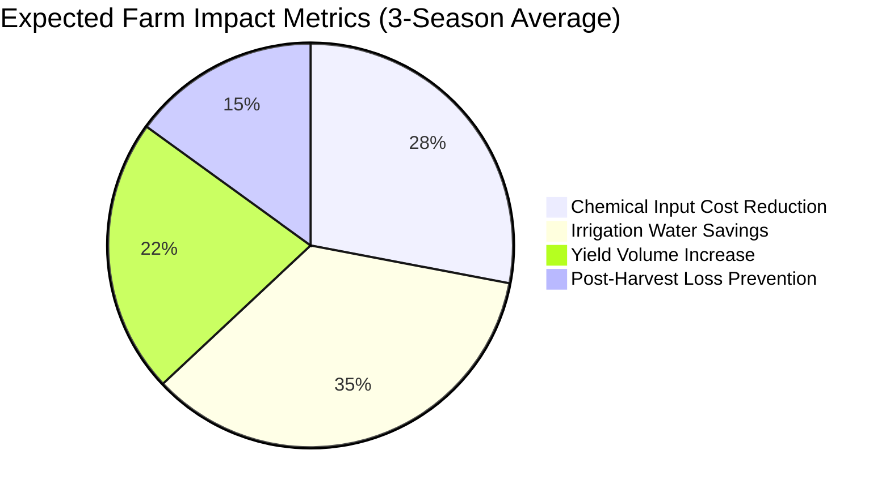

# FLIP v3.0 — Product Requirements Document (PRD)

> **Document Version**: 3.0.0  
> **Status**: Approved  
> **Target Release**: Q4 2026  
> **Classification**: Platform Engineering Specification  

---

## 1. Executive Summary & Product Vision

### 1.1 Project Overview
The **Farm Lifecycle Intelligence Platform (FLIP) v3.0** (also known as *Krishi Bhoomi Setu*) is a hyper-localized, offline-first, closed-loop agricultural intelligence operating system designed specifically for smallholder farmers across India. Modern agricultural extension systems suffer from generic weather forecasts, delayed lab results, unaffordable hardware, and fragmented advisory channels. FLIP bridges this divide by delivering an integrated, autonomous farm brain that:

$$\text{Sense} \longrightarrow \text{Detect} \longrightarrow \text{Predict} \longrightarrow \text{Recommend} \longrightarrow \text{Act} \longrightarrow \text{Verify} \longrightarrow \text{Learn} \longrightarrow \text{Harvest} \longrightarrow \text{Store} \longrightarrow \text{Sell}$$

### 1.2 Product Vision
> **"A farm's own brain: sees, speaks, learns, warns, earns."**

FLIP transforms farming from reactive guesswork into an evidence-backed science. It fuses camera vision, localized soil/canopy IoT telemetry, satellite indices (Sentinel-2), micro-weather forecasts, and historical agronomic profiles into an interactive **3D Farm Digital Twin**. Crucially, the platform operates seamlessly on sub-₹5,000 mobile phones in areas with zero connectivity, speaking directly in the farmer's native dialect through localized voice AI.

### 1.3 Core Value Propositions
- **Hyper-Localized Agronomy**: Micro-climate recommendations tailored to the specific 0.5-hectare plot rather than the block/district level.
- **Offline-First Resilience**: Full operational autonomy at the edge (Raspberry Pi Zero 2W gateway) and in the farmer's Progressive Web App (PWA) with CRDT synchronization upon network reconnect.
- **Evidence-Backed Transparency**: Every advisory provides a structured **NOW / NEXT / WHY / CONFIDENCE** breakdown backed by conformal prediction guarantees (95% coverage error bounds).
- **Closed-Loop Verification**: Every farmer action is verified via post-treatment telemetry or photos, driving continuous active learning and automatic model retraining.

---

## 2. User Personas & User Journeys

```mermaid
journey
    title Farmer Ramesh's Daily FLIP Journey
    section Morning Field Walk
      Inspect field with PWA: 5: Ramesh
      Voice query 'Hey Kisan, aaj kya karna hai?': 5: Ramesh, Voice Copilot
      Hear Marathi audio advisory: 5: Voice Copilot
    section Disease Discovery
      Spot leaf spotting on Tomato: 4: Ramesh
      Take camera photo in offline mode: 5: Ramesh, PWA Camera
      Local INT8 model runs preliminary triage: 5: Edge Gateway
    section Action & Verification
      Network restored; cloud Triton confirms Early Blight: 5: Cloud Triton
      Apply organic Copper Oxychloride as recommended: 5: Ramesh
      Post-spray photo logged: 5: Ramesh
    section Closed-Loop Feedback
      Telemetry registers humidity stabilization: 5: IoT Sensors
      Temporal workflow marks advisory verified: 5: Core API
```

### 2.1 Persona Definitions

| Persona | Role | Context & Constraints | Primary Goals |
|---------|------|----------------------|---------------|
| **Ramesh Patil** | Smallholder Farmer | • 2.5 acres in Pune district (Tomato & Onion)<br>• Low formal literacy, speaks Marathi<br>• Uses budget Android phone with intermittent 2G/4G | • Receive voice-first daily actionable guidance<br>• Stop crop loss before pest symptoms spread<br>• Save input costs on chemical fertilizers |
| **Dr. Priya Sharma** | Expert Agronomist | • Works at District Krishi Vigyan Kendra (KVK)<br>• High-resolution desktop & tablet setup<br>• Handles 200+ case escalations daily | • Rapidly review low-confidence model predictions<br>• Annotate ground-truth imagery for model retraining<br>• Broadcast emergency localized advisories |
| **Suresh Deshmukh** | FPO Manager | • Leads 450-member Farmer Producer Organization<br>• Manages bulk input procurement & produce aggregation | • Monitor aggregate pest/disease risk across cluster<br>• Schedule collective spraying & bulk fertilizer orders<br>• Maximize collective mandi pricing |
| **Vikram Singh** | District Agriculture Officer | • State Department of Agriculture<br>• Responsible for food security & disaster response | • Real-time vector-map view of disease hotspots<br>• Dispatch geo-targeted emergency siren/IVR alerts<br>• Track crop damage for insurance relief claims |

---

## 3. Functional Requirements (FR-00 to FR-17)

The platform is partitioned into 18 discrete, decoupled architectural segments:

### Segment 00: Foundation, Monorepo & Scaffolding
- **FR-00.1**: The system must maintain a unified monorepo using Turborepo and pnpm workspaces supporting TypeScript web applications and Python microservices.
- **FR-00.2**: All services must configure strict linting, type-checking (Ruff, Mypy, Biome, TypeScript strict), and containerized local orchestration via Docker Compose.
- **FR-00.3**: Local dev environment must bootstrap in under 120 seconds using automated secrets generation and database migrations.

### Segment 01: Identity, IAM & Access Management
- **FR-01.1**: The platform must integrate Keycloak 24+ providing OpenID Connect (OIDC) with PKCE for all web, edge, and mobile clients.
- **FR-01.2**: Farmers must authenticate passwordlessly via 6-digit phone SMS OTP with 30-day "Remember Me" trusted device fingerprinting.
- **FR-01.3**: Agronomists and administrators must enforce WebAuthn/FIDO2 Passkey multi-factor authentication (MFA).
- **FR-01.4**: Client tokens must be synced to PostgreSQL `profiles` via `POST /api/v1/auth/sync-profile` with Row-Level Security (RLS) enforcement.

### Segment 02: Storage, TimescaleDB & Geospatial Core
- **FR-02.1**: Telemetry readings must be stored in TimescaleDB hypertables with 1-day chunking, automated compression after 7 days, and 365-day retention.
- **FR-02.2**: Farm and field geometries must be indexed via PostGIS spatial indexes (`GIST` on `geometry` and `centroid`).
- **FR-02.3**: Visual embeddings (384-dim / 512-dim) must be indexed in PostgreSQL using `pgvector` with HNSW cosine distance indexing.

### Segment 03: Edge Gateway Hardware & OS
- **FR-03.1**: The edge gateway must run Ubuntu Core / BalenaOS on a Raspberry Pi Zero 2W (ARM64) drawing less than 1.5W average power.
- **FR-03.2**: Edge gateways must maintain an offline SQLite buffer storing at least 30 days of raw sensor telemetry and action logs.
- **FR-03.3**: The gateway must execute local INT8 quantized neural network inference using TFLite Runtime and ONNX Runtime.

### Segment 04: Sensor Node Firmware & LoRa Telemetry
- **FR-04.1**: Field sensor nodes must run Zephyr RTOS on ESP32-C3 microcontrollers with 15-minute deep sleep cycles (achieving 18+ month battery life).
- **FR-04.2**: Sensor nodes must transmit telemetry over LoRa (SX1262) to the Edge Gateway using binary CBOR encoding.
- **FR-04.3**: Sensor nodes must support fail-safe local ring-buffer storage on SPI NOR Flash (LittleFS) during gateway disconnects.

### Segment 05: Real-Time Ingestion & Message Bus
- **FR-05.1**: Gateways must push telemetry to EMQX via MQTT 5.0 with mutual TLS (mTLS) and X.509 client certificates.
- **FR-05.2**: EMQX rule engine must seamlessly forward sensor data to NATS JetStream subject `farm.<farm_id>.sensor.raw`.
- **FR-05.3**: Core API ingestion workers must consume raw streams, validate physics boundaries (EKF filter), and batch write into TimescaleDB.

### Segment 06: Farm Digital Twin & CRDT State Sync
- **FR-06.1**: The platform must implement event sourcing via `farm_twin_events` capturing every sensor delta, advisory, and farmer action.
- **FR-06.2**: State reconciliation between offline PWA, Edge Gateway, and Cloud must utilize Conflict-Free Replicated Data Types (CRDT / Yjs).
- **FR-06.3**: Materialized digital twin views must refresh in under 200ms following twin state events.

### Segment 07: Multimodal Cross-Attention AI
- **FR-07.1**: The ML inference engine must fuse RGB canopy imagery, sensor telemetry history (temperature, VWC, EC, leaf wetness), and forecast weather.
- **FR-07.2**: Cloud inference must execute via Triton Inference Server with TensorRT GPU acceleration (<150ms p99 latency).
- **FR-07.3**: Every prediction must compute a Conformal Prediction Set guaranteeing a user-configured coverage rate ($1 - \alpha = 0.95$).

### Segment 08: Closed-Loop Advisory Engine
- **FR-08.1**: Advisories must be structured in strict schema: **NOW** (immediate action), **NEXT** (preparation for upcoming 48h), **WHY** (plain-language causal rationale), and **CONFIDENCE** (prediction set & metric bounds).
- **FR-08.2**: Advisories must calculate chemical and organic treatment pathways along with exact dosage scaled to field acreage.
- **FR-08.3**: Temporal.io workflows must schedule outcome verification windows (e.g., check leaf wetness delta 48h post-irrigation).

### Segment 09: Expert Review & Active Learning Queue
- **FR-09.1**: Predictions where conformal prediction set size $>1$ (high epistemic uncertainty) or maximum softmax probability $<0.70$ must automatically route to the expert triage queue.
- **FR-09.2**: Experts must receive a web studio displaying crop history, spatial maps, side-by-side comparative images, and one-click diagnostic labeling.
- **FR-09.3**: Expert-confirmed labels must automatically deposit into `training_samples` as high-priority ground truth.

### Segment 10: Continual Learning & MLOps Pipeline
- **FR-10.1**: Retraining workflows must automatically trigger when newly verified ground-truth samples $\ge 200$ AND (covariate drift detected via Kolmogorov-Smirnov test $p < 0.01$ OR 30 days elapsed).
- **FR-10.2**: The pipeline must execute PyTorch Lightning distributed training, evaluate calibration error (ECE), and log artifacts to MLflow and DVC.
- **FR-10.3**: Model promotion to production must require passing a shadow-mode evaluation gate with zero safety-critical regressions.

### Segment 11: Progressive Web App (Offline-First)
- **FR-11.1**: The web application must register a Workbox Service Worker implementing Cache-First strategies for application shells, static assets, and map tiles.
- **FR-11.2**: All user mutations performed offline must enqueue into IndexedDB and replay automatically using the Background Sync API upon reconnection.
- **FR-11.3**: PWA must remain fully interactive and render the last-known farm state without showing blocking loading spinners.

### Segment 12: 3D Visual Farm Canvas
- **FR-12.1**: The dashboard must render the farmer's plot in 3D using React Three Fiber, WebGL shaders, and instanced crop foliage.
- **FR-12.2**: Soil moisture and temperature values must project onto the 3D terrain as dynamic heatmap shaders.
- **FR-12.3**: Macro geographic maps must stream Mapbox Vector Tiles (MVT) generated directly from PostGIS via Martin Tile Server.

### Segment 13: Multilingual Voice Copilot
- **FR-13.1**: The PWA must support voice interaction in 10 Indic languages: Hindi, Marathi, Telugu, Kannada, Gujarati, Punjabi, Bengali, Odia, Assamese, and Indian English.
- **FR-13.2**: Voice interaction must support both offline on-device speech-to-text (Whisper.cpp WASM) and server-assisted dialogue management via Rasa and Llama-3-8B RAG.
- **FR-13.3**: Responses must synthesize via Piper TTS in local language audio streamable over low-bandwidth connections.

### Segment 14: Disaster Early Warning & Emergency Siren
- **FR-14.1**: Ingestion of IMD/NDMA disaster alerts (flash flood, cyclone, heatwave, locust swarm) must trigger automated spatial polygon intersection against farm geometries.
- **FR-14.2**: Edge gateways in the affected perimeter must physically activate a 110dB audio siren and loop pre-recorded emergency voice guidelines.
- **FR-14.3**: The cloud alert engine must dispatch automated Twilio voice calls, SMS, WhatsApp notifications, and full-screen vibrating web push overlays in under 30 seconds.

### Segment 15: Zero-Trust Security & Device Attestation
- **FR-15.1**: All network traffic between Edge, Ingestion, Cloud Services, and Frontend must enforce TLS 1.3 with strict mTLS on IoT broker connections.
- **FR-15.2**: Edge firmware and container images must be cryptographically signed using Sigstore Cosign with verification before execution.
- **FR-15.3**: Database queries must enforce PostgreSQL Row-Level Security based on JWT claims (`org_id`, `role`, `user_id`).

### Segment 16: Harvest Intelligence & Market Linkage
- **FR-16.1**: The platform must ingest daily wholesale commodity prices from official government AGMARKNET APIs across surrounding mandis.
- **FR-16.2**: Optimal harvest dates must be predicted by combining growth stage (BBCH scale), thermal time (Growing Degree Days), and forecast rainfall.
- **FR-16.3**: FPO managers must have bulk produce aggregation dashboards to negotiate forward contracts with institutional buyers.

### Segment 17: Observability, SRE & Operations
- **FR-17.1**: All Python, Node.js, and Go services must emit standardized OpenTelemetry distributed traces and Prometheus metrics.
- **FR-17.2**: Grafana dashboards must provide real-time visibility into ingestion rates, inference latency percentiles (p50, p95, p99), edge heartbeat status, and error budgets.
- **FR-17.3**: Sentry must capture and aggregate client-side and server-side runtime exceptions with sourcemap deobfuscation.

---

## 4. Non-Functional Requirements (NFR)

### 4.1 Performance & Latency
| Metric | Threshold | Target | Measurement Point |
|--------|-----------|--------|-------------------|
| Edge Inference Latency | $<350\text{ ms}$ | $<180\text{ ms}$ | Raspberry Pi Zero 2W INT8 model execution |
| Cloud Advisory Round-Trip | $<3.5\text{ s}$ | $<1.8\text{ s}$ | PWA photo submission to Advisory Card render |
| Emergency Alert Broadcast | $<60\text{ s}$ | $<30\text{ s}$ | Ingestion of disaster event to siren/push trigger |
| GraphQL Query Latency (p99) | $<250\text{ ms}$ | $<90\text{ ms}$ | Core API query execution over cached pool |
| PWA Initial Bundle Load | $<4.0\text{ s}$ | $<1.9\text{ s}$ | Cold cache load on simulated 3G network |

### 4.2 Availability & Resilience
- **Cloud Platform Uptime**: 99.9% monthly availability (excluding scheduled maintenance).
- **Edge Gateway Autonomy**: 99.99% operational continuity during complete cloud disconnection (up to 30 continuous days).
- **Zero Data Loss Ingestion**: JetStream storage with at-least-once delivery guarantees and persistent file storage.

### 4.3 Scalability Targets
- Support **100,000 active farms** across 5 agro-climatic zones in Phase 1.
- Ingestion engine capacity of **20,000 sensor messages per second** sustained throughput.
- Support **10,000 concurrent real-time WebSocket subscriptions** for live 3D sensor streams.

### 4.4 Security & Compliance
- **Zero Trust Architecture**: No internal service communication over unauthenticated channels.
- **Data Locality**: 100% of farmer personal, geospatial, and agronomic data stored exclusively within Indian data centers (MeitY empanelled cloud).
- **Data Sovereignty**: Farmers own their data and may request cryptographic export or deletion at any time.

---

## 5. Feature Priority Matrix

```text
Priority Definitions:
• P0 (Critical - MVP): Core foundation, telemetry, basic advisory, offline PWA, voice.
• P1 (High - v3.0 Scope): Conformal prediction, active learning, 3D farm canvas, disaster alerts.
• P2 (Medium - Subsequent): Advanced market trading, drone imagery ingestion, harvest forward contracts.
```

| Segment | Feature Area | Priority | Target Release |
|---------|--------------|:--------:|:--------------:|
| 00 | Monorepo, Dev Tooling & CI/CD | **P0** | Implemented |
| 01 | Keycloak IAM, SMS OTP & Passkeys | **P0** | Implemented |
| 02 | TimescaleDB Hypertables & PostGIS | **P0** | Implemented |
| 03 | Edge Gateway OS & Pi Zero 2W Runtime | **P0** | v3.0 |
| 04 | ESP32-C3 Sensor Firmware & LoRa | **P0** | v3.0 |
| 05 | EMQX Ingestion & NATS JetStream | **P0** | v3.0 |
| 06 | Farm Digital Twin & CRDT Sync | **P0** | v3.0 |
| 07 | Multimodal Fusion & Conformal AI | **P1** | v3.0 |
| 08 | Closed-Loop Advisory Engine | **P0** | v3.0 |
| 09 | Agronomist Review Queue | **P1** | v3.0 |
| 10 | Kubeflow Automated Retraining | **P1** | v3.0 |
| 11 | Offline-First PWA (Workbox) | **P0** | v3.0 |
| 12 | 3D Visual Farm Twin (R3F) | **P1** | v3.0 |
| 13 | 10-Language Voice Copilot | **P0** | v3.0 |
| 14 | Disaster Siren & Emergency Push | **P1** | v3.0 |
| 15 | mTLS & Sigstore Supply Chain Security | **P0** | v3.0 |
| 16 | AGMARKNET Mandi Price Ingestion | **P2** | v3.1 |
| 17 | OpenTelemetry, Prometheus & Grafana | **P1** | v3.0 |

---

## 6. Release Criteria & Quality Gates

1. **Test Coverage**: Minimum 85% line coverage across Python Core API services and TypeScript PWA packages.
2. **Offline Simulation**: Zero data loss during automated 72-hour simulated internet blackout test with 500 simulated mutations.
3. **Conformal Coverage**: Conformal prediction empirical coverage must validate $\ge 94.5\%$ on holdout evaluation sets across all target crops (Tomato, Onion, Cotton, Chilli).
4. **Voice Accuracy**: Intent recognition accuracy $>92\%$ across all 10 Indic languages with noisy rural background audio simulation.
5. **Security Audit**: Zero High or Critical CVEs in container scans (Trivy) and dependency graphs (Dependabot/Snyk).

---

## 7. Success Metrics & Impact KPIs



- **Water Conservation**: $\ge 30\%$ reduction in agricultural water consumption through precision evapotranspiration (ET0) sensor scheduling.
- **Chemical Input Reduction**: $\ge 25\%$ reduction in chemical pesticide and fungicide applications via pre-symptomatic micro-climate warnings.
- **Yield Enhancement**: $\ge 18\%$ increase in marketable crop yield through optimal harvesting and timely nutrient interventions.
- **Advisory Adoption**: $\ge 75\%$ verified action completion rate within 48 hours of advisory issuance.
- **Farmer Retention**: $\ge 85\%$ active weekly usage throughout the crop season.
