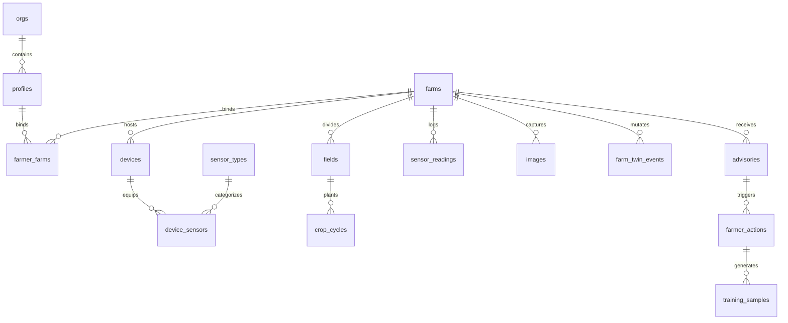
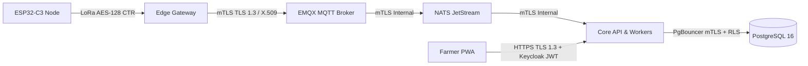

# FLIP v3.0 — Technical Requirements Document (TRD)

> **Document Version**: 3.0.0  
> **Status**: Approved  
> **Architecture Style**: Event-Driven Microservices + Edge-Assisted Fog Computing  

---

## 1. System Architecture Overview

```mermaid
graph TB
    subgraph Field Layer ["🌱 Field & Edge Perimeter"]
        SN1["ESP32-C3 Sensor Node 1<br>(Soil VWC/EC, SHT45)"] -->|LoRa SX1262| GW["Edge Gateway<br>(Raspberry Pi Zero 2W)"]
        SN2["ESP32-C3 Sensor Node 2<br>(Leaf Wetness, Rain)"] -->|LoRa SX1262| GW
        CAM["Trap / Field Camera"] -->|Wi-Fi / USB| GW
        GW -->|SQLite Outbox / EKF Filter| GW
        GW -->|110dB Audio Siren| SIREN["Emergency Siren"]
    end

    subgraph Ingestion Layer ["⚡ Cloud Ingestion & Messaging"]
        GW -->|MQTT 5.0 over mTLS| EMQX["EMQX Broker Cluster"]
        EMQX -->|Bridge Rule| NATS["NATS JetStream Bus<br>(5 Core Streams)"]
    end

    subgraph Service Mesh ["🏛️ Cloud Core Services"]
        NATS --> INGEST_SVC["Ingestion Worker<br>(FastAPI Batcher)"]
        INGEST_SVC --> DB[("TimescaleDB + PostGIS<br>+ pgvector (Postgres 16)")]
        
        API["Core API Service<br>(FastAPI + Strawberry GraphQL)"] <--> DB
        API <--> NATS
        
        TEMP["Temporal.io Cluster<br>(Durable Workflows)"] <--> API
        
        TRITON["Triton Inference Server<br>(TensorRT Multimodal Fusion)"] <--> API
        
        RAG["Copilot RAG Service<br>(FastAPI + LlamaIndex)"] <--> DB
        
        ALERT["Alert Engine<br>(Node.js Fastify)"] <-- NATS
        ALERT --> NOTIF["Twilio (SMS/IVR) + WhatsApp + FCM"]
    end

    subgraph Client Layer ["📱 Multi-Tenant Frontends"]
        PWA["Farmer PWA<br>(React 18 + R3F + Workbox SW)"] <-->|GraphQL / REST / WSS| API
        PWA <-->|Offline Cache & CRDT| IDB[("IndexedDB + WebCrypto")]
        EXPERT["Expert Studio & Admin Dashboard"] <--> API
    end

    subgraph IAM & Security ["🛡️ Identity & Secrets"]
        KC["Keycloak 24 IAM<br>(SMS OTP SPI + Passkeys)"] <--> PWA
        KC <--> EXPERT
        VAULT["HashiCorp Vault<br>(mTLS PKI & Dynamic Secrets)"] -.-> Service Mesh
    end
```

### 1.1 Non-Negotiable Architectural Constraints
1. **Zero Unauthenticated Traffic**: Every client request must carry a cryptographically validated Keycloak JWT or client mTLS certificate.
2. **Offline Resilience**: Both the PWA and the Edge Gateway must operate autonomously for at least 30 continuous days without cloud connectivity.
3. **Strict Causal Event Sourcing**: Every change in the physical farm state must record as an immutable event in `farm_twin_events` before materializing.
4. **Statistical Safety Guarantees**: Model recommendations must produce Conformal Prediction Sets with bounded error rates ($1 - \alpha \ge 0.95$).

---

## 2. Technology Stack Matrix

| Architectural Tier | Component | Technology Selected | Version | Purpose & Rationale |
|-------------------|-----------|---------------------|---------|----------------------|
| **Sensor Firmware** | RTOS Core | Zephyr RTOS | 3.6.0 | Microkernel RTOS with native low-power tickless idle for ESP32-C3 |
| | Sensor Comms | LoRa (SX1262) | Hardware | Long-range penetration across foliage up to 2.5km line-of-sight |
| **Edge Gateway** | Hardware | Raspberry Pi Zero 2W | Rev 1.0 | Quad-core ARM Cortex-A53, ₹1,800 unit cost, 1.2W power draw |
| | Operating System | Ubuntu Core / BalenaOS | 22.04 | Immutable, atomic A/B updates with hardware watchdog |
| | Edge Runtime | Python | 3.11.9 | Pinned system Python runtime for edge services |
| | Edge ML Engine | TFLite Runtime + ONNX | 2.15 / 1.17 | Quantized INT8 inference on ARM NEON (<180ms execution) |
| **Ingestion & Bus** | MQTT Broker | EMQX Enterprise | 5.5.0 | Scalable MQTT 5.0 broker supporting 1M+ mTLS connections |
| | Event Streaming | NATS JetStream | 2.10.x | Ultra-lightweight persistent event streaming and key-value store |
| **Data Layer** | Relational & Geo | PostgreSQL + PostGIS | 16.2 / 3.4 | Multi-tenant spatial database with Row-Level Security (RLS) |
| | Time-Series | TimescaleDB | 2.14.2 | Automated compression, hypertable chunking for sensor telemetry |
| | Vector Store | pgvector | 0.7.0 | In-database HNSW cosine distance indexing for 384/512-dim embeddings |
| | Object Storage | MinIO | RELEASE.2024 | S3-compatible storage for raw imagery, point clouds, and weights |
| **Core Services** | Backend Framework | FastAPI | 0.109.0 | High-throughput asynchronous REST & WebSocket framework |
| | GraphQL Server | Strawberry GraphQL | 0.232.0 | Code-first GraphQL with schema federation support |
| | Workflow Engine | Temporal.io | 1.5.0 | Resilient, stateful distributed orchestration for verification loops |
| | Dialogue Engine | Rasa Open Source | 3.6.2 | Deterministic intent extraction and multi-turn dialogue management |
| **AI / ML Stack** | Training Pipeline | PyTorch Lightning | 2.2.0 | Scalable multi-modal training framework |
| | Inference Engine | Triton Inference Server | 24.04 | Dynamic batching and GPU-accelerated TensorRT execution |
| | Uncertainty Bounds| Nonconformist / Custom | 2.1.0 | Split conformal prediction calibration guaranteeing 95% coverage |
| | MLOps Registry | MLflow + DVC | 2.9 / 3.45 | Model lineage tracking and large dataset version control |
| **Web Frontend** | Core Framework | React + TypeScript | 18.2 / 5.3 | Component-driven frontend architecture with strict typing |
| | Build Tooling | Vite + Turborepo | 5.1 / 2.0 | Instant Hot Module Replacement and cached monorepo orchestration |
| | 3D Visualization | React Three Fiber (R3F) | 8.15.x | WebGL 3D farm canvas with custom terrain shaders |
| | Offline PWA | Workbox | 7.0.0 | Precaching, runtime route caching, and Background Sync API |
| | Local Storage | IndexedDB + WebCrypto | Standard | Encrypted client-side store for tokens, models, and mutation queues |

---

## 3. Service Specifications

### 3.1 Core API (`services/core-api`)
- **Protocol Support**:
  - REST: `/api/v1/*` (Authentication, uploads, telemetry queries)
  - GraphQL: `/graphql` (Strawberry schema with field-level role guards)
  - WebSocket: `/ws/farms/{farm_id}/sensors` (Live proxy to NATS JetStream)
- **Database Engine**: Async SQLAlchemy 2.0 with PgBouncer connection pooling.
- **Workflow Client**: Temporal.io worker dispatching `AdvisoryVerificationWorkflow` and `ModelRetrainingWorkflow`.
- **Performance Targets**: $<90\text{ ms}$ p99 latency on GraphQL queries; $<400\text{ ms}$ on REST mutations.

### 3.2 Farmer PWA (`apps/web`)
- **Architecture**: Domain-driven feature layout (`auth`, `farms`, `advisories`, `copilot`, `sensors`).
- **State Management**: Zustand for UI and offline queue state; TanStack React Query for server cache invalidation.
- **WASM Modules**:
  - `whisper.cpp` WASM: On-device offline speech recognition.
  - `piper-tts` WASM: On-device localized audio synthesis.
  - `pvporcupine` WASM: Ultra-low-power browser wake-word detection ("Hey Kisan").

### 3.3 Edge Gateway (`edge/gateway`)
- **Core Loop**: Consumes serial packets from LoRa SX1262 HAT $\rightarrow$ validates CRC $\rightarrow$ enqueues to SQLite outbox $\rightarrow$ drains via mTLS MQTT 5.0 to cloud.
- **Inference Sandbox**: Runs lightweight CropNet and DiseaseNet models in INT8 format to provide offline disease triage.
- **Hardware Peripherals**: Directly controls 12V audio siren relay via GPIO pin 18.

### 3.4 Sensor Nodes (`edge/sensor-node`)
- **Hardware Controller**: ESP32-C3 RISC-V microcontroller.
- **Sensors Interfaced**: Sensirion SHT45 (Air Temp / RH), Decagon Capacitive Soil Probe (VWC / EC), Optical Leaf Wetness sensor.
- **Power Budget**: 15-minute deep sleep ($<12\mu\text{A}$ sleep draw), 250ms active transmit window at 14dBm.

### 3.5 Cloud Ingestion & Anomaly
- **EMQX Broker**: Configured with mTLS client authentication, X.509 CRL checks, and Redis ACL lookups.
- **Ingestion Workers**: Validate incoming sensor frames against Extended Kalman Filter (EKF) physical constraint bounds (e.g., flag impossible temperature jumps $>5^\circ\text{C}$ in 15 minutes).

---

## 4. Data & Event Architecture

### 4.1 Database Schema Overview
The database layer combines standard relational tables, TimescaleDB hypertables, PostGIS geometries, and pgvector embeddings:



### 4.2 NATS JetStream Event Schema

| Stream Name | Subjects Covered | Retention Policy | Max Age | Storage Type |
|-------------|------------------|------------------|---------|--------------|
| `FARM_SENSOR` | `farm.*.sensor.raw`, `farm.*.sensor.validated` | Limits | 7 Days | File |
| `FARM_ADVISORY` | `farm.*.advisory.issued`, `farm.*.action.taken` | Limits | 30 Days | File |
| `FARM_TWIN` | `farm.*.twin.updated`, `farm.*.crdt.diff` | Limits | 14 Days | File |
| `DISASTER` | `region.*.disaster.alert`, `farm.*.siren.trigger` | Limits | 90 Days | File |
| `ML_TRAINING` | `model.registry.updated`, `farm.*.training.sample`| Limits | 365 Days | File |

### 4.3 Standard CloudEvents v1.0 Format
All NATS JetStream payloads strictly adhere to the CloudEvents v1.0 specification:

```json
{
  "specversion": "1.0",
  "id": "e2a7b3c1-6b45-412f-924b-3026a71e8df1",
  "source": "/services/core-api",
  "type": "flip.advisory.generated.v1",
  "datacontenttype": "application/json",
  "time": "2026-09-17T11:45:00.000Z",
  "data": {
    "advisory_id": "ADV-20260917-8192",
    "farm_id": "c1f7a012-38b4-4b47-8a88-6622b7a91a92",
    "field_id": "f8a201b1-21c3-421b-801a-112233445566",
    "risk_level": "WARNING",
    "disease_code": "TOMATO_EARLY_BLIGHT",
    "confidence_set": ["TOMATO_EARLY_BLIGHT"],
    "coverage_guarantee": 0.95,
    "recommendation": {
      "now": "Spray Copper Oxychloride at 2.5g/L before sunset.",
      "next": "Inspect lower canopy in 48 hours.",
      "why": "High humidity (>88%) and leaf wetness match germination window."
    }
  }
}
```

---

## 5. AI / ML Pipeline

### 5.1 Multimodal Cross-Attention Architecture
The core perception engine fuses heterogeneous modalities into a unified embedding space:
1. **Canopy Vision**: MobileNetV4 / ConvNeXt-Femto backbone extracting $d=384$ spatial feature vectors.
2. **Telemetry Encoder**: 1D-CNN over 72-hour rolling sensor windows (temperature, humidity, soil VWC, solar radiation).
3. **Cross-Attention Fusion Layer**: Cross-attends visual tokens with physical telemetry tokens to capture environmental causality (e.g., detecting fungal lesions only when sustained canopy humidity exists).

### 5.2 Conformal Prediction Calibration
To protect farmers from algorithmic hallucinations, the model applies **Split Conformal Prediction**:
- Calibration score: $s_i = 1 - \hat{f}(X_i)_{Y_i}$ (nonconformity score).
- Compute quantile: $\hat{q} = \text{Quantile}\left(s, \frac{\lceil (n+1)(1-\alpha) \rceil}{n}\right)$ where $\alpha = 0.05$.
- Prediction Set: $C(X_{test}) = \{ y \in \mathcal{Y} : \hat{f}(X_{test})_y \ge 1 - \hat{q} \}$.
- **Abstention Criterion**: If $|C(X_{test})| > 1$, cloud automatically flags epistemic ambiguity and queues case for human agronomist review.

### 5.3 Retraining & Continuous Learning
- **Trigger**: New ground-truth samples $\ge 200$ AND (Kolmogorov-Smirnov test drift $p < 0.01$ on embeddings OR 30 days elapsed).
- **Execution**: Kubeflow pipeline triggers distributed training $\rightarrow$ updates MLflow model registry $\rightarrow$ builds Canary container $\rightarrow$ deploys to shadow traffic for 48h $\rightarrow$ promotes to production Triton server.

---

## 6. Security & Cryptography



- **Authentication & Identity**: Keycloak 24+ acting as centralized OIDC Identity Provider with custom SMS OTP SPI.
- **Hardware Supply Chain**: All edge firmware images signed via Sigstore Cosign keyless infrastructure.
- **Data-at-Rest Encryption**: PostgreSQL tablespaces encrypted using AES-256 (LUKS volume encryption on cloud disks).
- **Row-Level Security (RLS)**: Enforced via `app.current_user_id` and `app.current_role` session variables set by Core API middleware.

---

## 7. Observability & SRE

- **Distributed Tracing**: OpenTelemetry instrumentation integrated across FastAPI, SQLAlchemy, HTTPX, and NATS, exporting to Grafana Tempo.
- **Metrics Collection**: Prometheus scraper targeting `/metrics` endpoints across all microservices.
- **Structured Logs**: JSON logs emitted to stdout via `structlog` and aggregated by Grafana Loki.
- **Service Level Objectives (SLOs)**:
  - Ingestion Pipeline Availability: $\ge 99.95\%$
  - Advisory Generation Latency: $p95 < 2.5\text{ s}$
  - Edge Heartbeat Freshness: $< 180\text{ s}$ elapsed between consecutive gateway pings.

---

## 8. Deployment & Infrastructure

- **Local Development**: Docker Compose orchestrating Postgres/TimescaleDB, MinIO, EMQX, NATS, Keycloak, Temporal, and Martin.
- **Staging & Production**: Kubernetes (K3s / RKE2) managed through GitOps with ArgoCD.
- **Disaster Recovery (DR)**: Active-Passive cross-region replication (Primary: Mumbai, Secondary DR: Hyderabad) with $<5\text{ minute}$ RPO and $<1\text{ hour}$ RTO.
