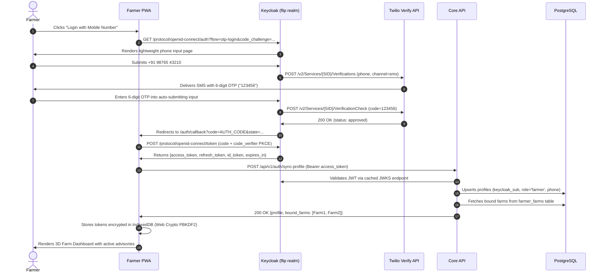
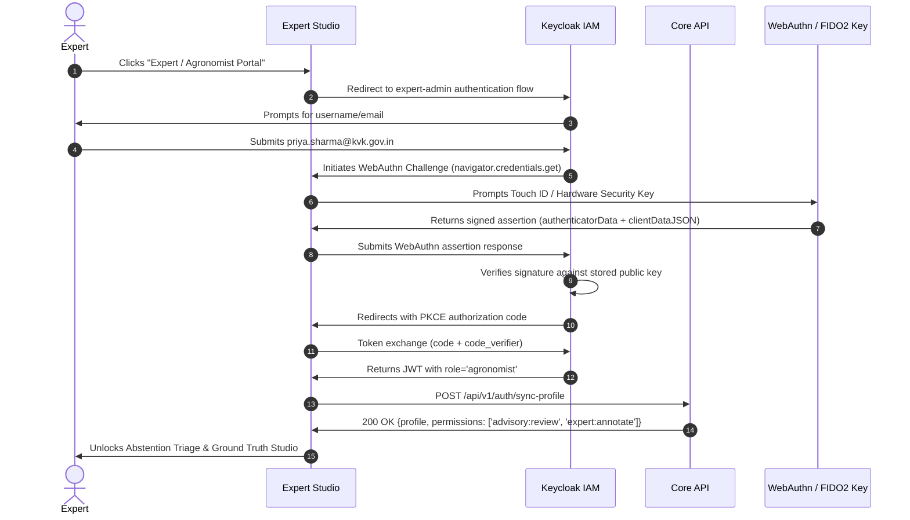
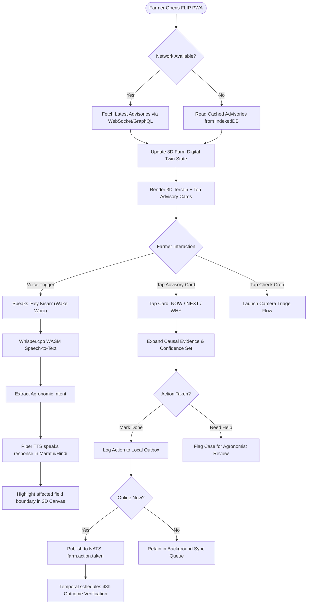
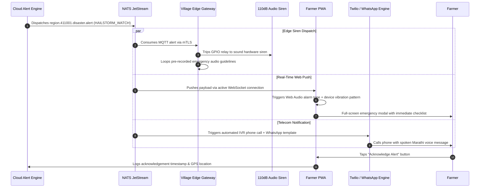
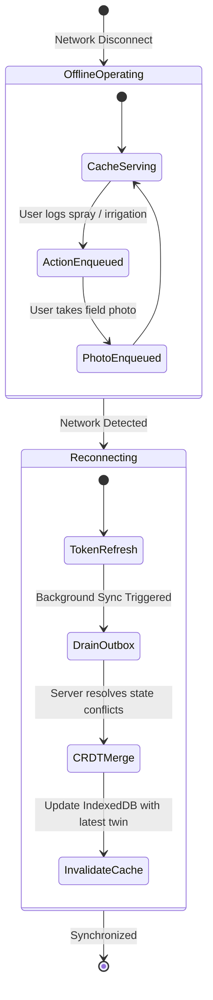

# FLIP v3.0 — Web App Flow Documentation

> **Target Application**: Farmer Progressive Web App (PWA) & Unified Admin Studio  
> **State Engines**: React 18 + Zustand + TanStack Query + Workbox + IndexedDB  

---

## 1. Authentication Flows

### 1.1 Farmer OTP Login Flow


### 1.2 Expert & Agronomist Passkey Login Flow


### 1.3 Offline Session Restore Flow
```mermaid
sequenceDiagram
    autonumber
    actor Farmer
    participant PWA as Farmer PWA
    participant SW as Workbox Service Worker
    participant IDB as IndexedDB (Encrypted)
    participant Crypto as Web Crypto API

    Farmer->>PWA: Opens app in rural zone with NO internet connection
    PWA->>SW: Intercepts fetch for /
    SW->>PWA: Serves cached App Shell & WASM binaries (Cache-First)
    PWA->>IDB: Reads encrypted session record
    PWA->>Crypto: Decrypts cached JWT using local device key
    alt Token Valid (Unexpired)
        PWA->>IDB: Loads last-synced farm digital twin & active advisories
        PWA->>Farmer: Displays full 3D Dashboard with "Offline Mode" indicator
    else Token Expired (<30 days & Trusted Device)
        PWA->>IDB: Validates 30-day Trusted Device Fingerprint HMAC
        PWA->>Farmer: Allows read-only offline access; prompts re-auth on reconnect
    end
    Note over PWA,Farmer: All offline interactions (e.g. spray logged) append to Mutation Outbox
```

---

## 2. Core Farmer Flows

### 2.1 Daily Advisory Consumption Workflow


### 2.2 Multimodal Crop Health Check Flow
```mermaid
sequenceDiagram
    autonumber
    actor Farmer
    participant PWA as PWA Client
    participant Camera as Device Camera
    participant MinIO as MinIO Object Store
    participant Core as Core API
    participant Triton as Triton Inference
    participant Conformal as Conformal Engine
    participant NATS as NATS JetStream

    Farmer->>PWA: Taps "Check Crop" icon
    PWA->>Camera: Opens viewfinder with leaf alignment overlay
    Farmer->>Camera: Takes photo of symptomatic crop foliage
    PWA->>PWA: Checks focus/blur locally (Laplacian variance > 100)
    alt Online Connection
        PWA->>Core: Requests presigned upload URL
        Core->>PWA: Returns presigned S3 PUT URL (MinIO)
        PWA->>MinIO: Uploads raw image payload
        PWA->>Core: POST /api/v1/analyze/image {s3_key, crop_type, field_id}
        Core->>Core: Gathers 72h weather + soil sensor context
        Core->>Triton: Dispatches multimodal inference (image + sensor tensor)
        Triton->>Core: Returns raw logits + feature embeddings
        Core->>Conformal: Evaluates Nonconformity Scores (alpha=0.05)
        Conformal->>Core: Returns prediction_set: ["EARLY_BLIGHT"]
        alt High Confidence (Set Size = 1)
            Core->>PWA: 200 OK (Diagnosis, Chemical/Organic treatment, Dosage)
            PWA->>Farmer: Plays local audio explanation & displays Action Card
        else Low Confidence / Ambiguity (Set Size > 1)
            Core->>NATS: Publishes to expert.triage.queue
            Core->>PWA: 200 OK (Status: "Routed to KVK Expert")
            PWA->>Farmer: "Sent to Dr. Priya Sharma. Review expected in 30 minutes."
        end
    else Offline Mode
        PWA->>PWA: Runs local Edge TFLite INT8 model in Web Worker
        PWA->>PWA: Stores image and preliminary result in IndexedDB Outbox
        PWA->>Farmer: Displays preliminary warning; queues full cloud verification
    end
```

### 2.3 Disaster Alert Reception & Emergency Siren


---

## 3. Expert & Administrative Workflows

### 3.1 Abstention Review Queue Workflow
```text
Expert Studio Dashboard
    │
    ├── 1. Filter Queue by: Crop Type (Tomato/Onion), Urgency (High/Medium), Region
    │
    ├── 2. Select Case #8491 (Uncertainty Set: ["Early Blight", "Late Blight"])
    │       ├── High-resolution zoomable photo viewer with contrast enhancement
    │       ├── Micro-climate sensor telemetry (72h canopy humidity, leaf wetness)
    │       ├── Historic field occurrences and neighboring plot outbreak status
    │
    ├── 3. Submit Diagnosis:
    │       ├── Confirm Ground Truth Label: "Early Blight"
    │       ├── Custom Dosage Notes: "Apply Dithane M-45 at 2g/L; avoid overhead irrigation"
    │       ├── Mark verification source: EXPERT_INSPECTION
    │
    └── 4. System Action:
            ├── Farmer receives high-priority push notification and audio playback
            └── Case appends to training_samples table to retrain model in next cycle
```

### 3.2 FPO Manager Bulk Advisory Workflow
1. **Regional Heatmap Inspection**: FPO Manager opens `/fpo/map` viewing vector-tiled aggregation of all 450 member farms.
2. **Cluster Risk Filtering**: Identifies 38 contiguous farms in Sector B exhibiting high fungal infection vulnerability due to recent localized downpours.
3. **Draft Bulk Intervention**:
   - Action: Preventive collective spraying of organic Trichoderma viride.
   - Bulk Input Aggregation: Calculates total chemical volume needed (95 kg) and triggers bulk procurement discount through affiliated supplier.
4. **Dispatch**: Transmits coordinated advisory via WhatsApp and PWA notifications simultaneously to all 38 member farmers.

---

## 4. Government & Agricultural Officer Flows

### 4.1 District Hotspot Monitoring & Outbreak Containment
- **Map Navigation**: District Officers navigate interactive MapLibre vector tiles rendered dynamically from Martin Tile Server.
- **Layer Toggles**:
  - Pest Infestation Density (e.g., Fall Armyworm trap camera counts)
  - Soil Moisture Depletion Index (Drought vulnerability)
  - Severe Weather Threat Polygons (IMD weather alert feeds)
- **Containment Polygon Creation**: Officer draws a spatial containment polygon $\rightarrow$ triggers automated SMS warnings and pesticide subsidization allocations to all farmers within the boundary.

---

## 5. Offline State Machine & Synchronization Matrix



| Operational Scenario | Farmer PWA Behavior | Edge Gateway Behavior | Reconciliation Strategy |
|----------------------|---------------------|-----------------------|-------------------------|
| **Total Cloud Disconnect** | Instant cached views; local WASM voice queries; mutations saved to IndexedDB. | Telemetry continues over LoRa; local TFLite INT8 inference; emergency siren operational. | All mutations held in local persistent outbox. |
| **Partial / Intermittent 2G** | Prioritizes critical alert polling over high-resolution imagery transfers. | Batches sensor telemetry into compressed 50-reading bursts. | Exponential backoff with jitter on non-essential uploads. |
| **State Conflict on Reconnect** | Merges server digital twin updates using CRDT (Yjs) vector clocks. | Drains SQLite outbox to NATS JetStream with deduplication keys. | CRDT rule: Latest timestamp wins on actions; sensor series is unioned; server authoritative on alerts. |
